<p align="center">
  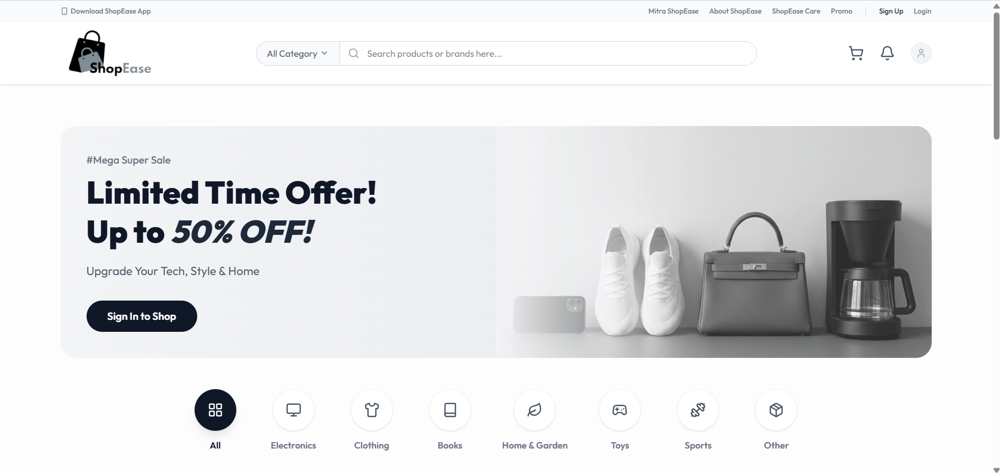
</p>

<h1 align="center">🛒 ShopEase — E-Commerce Order Management System</h1>

<p align="center">
  <strong>A production-grade, full-stack e-commerce platform powered by WSO2 Ballerina & WSO2 Asgardeo</strong>
</p>

<p align="center">
  <a href="https://main.d3tjwfz4pcs2v.amplifyapp.com/">🌐 Live Demo</a> •
  <a href="#-architecture">📐 Architecture</a> •
  <a href="#-wso2-products-used">🔧 WSO2 Products</a> •
  <a href="#-getting-started">🚀 Getting Started</a> •
  <a href="#-screenshots">📸 Screenshots</a>
</p>

<p align="center">
  
  
  
  
  
  
</p>

---

## 📖 Table of Contents

- [Overview](#-overview)
- [WSO2 Products Used](#-wso2-products-used)
- [Architecture](#-architecture)
- [Tech Stack](#-tech-stack)
- [Features](#-features)
- [Screenshots](#-screenshots)
- [Project Structure](#-project-structure)
- [Getting Started](#-getting-started)
- [API Reference](#-api-reference)
- [Deployment](#-deployment)
- [License](#-license)

---

## 📋 Overview

**ShopEase** is a fully functional, production-deployed e-commerce order management system built as a **real-world project** that demonstrates the practical use of **two WSO2 products**:

| WSO2 Product | Role in This Project |
|---|---|
| **WSO2 Ballerina** (Language & Runtime) | Powers the entire backend — four independent microservices handling products, orders, customers, and notifications |
| **WSO2 Asgardeo** (Identity-as-a-Service) | Handles all authentication & authorization — user registration, login, OTP verification, JWT token issuance, and role-based access control (RBAC) |

> **🎯 This project earns 2 points under the criteria:** *"Use a WSO2 product in a real-world project or solution — 2 points per project"*

The platform is **live and publicly accessible** at:  
🔗 **[https://main.d3tjwfz4pcs2v.amplifyapp.com/](https://main.d3tjwfz4pcs2v.amplifyapp.com/)**

---

## 🔧 WSO2 Products Used

### 1. WSO2 Ballerina — Backend Microservices

[Ballerina](https://ballerina.io/) is WSO2's open-source, cloud-native programming language purpose-built for integration and microservices. In ShopEase, Ballerina powers **four independent HTTP microservices**, each running on its own port:

| Service | Port | Ballerina File | Responsibilities |
|---|---|---|---|
| **Product Service** | `:9090` | `product_service.bal` | Full CRUD for product catalog, category filtering, Cloudinary image uploads, dual pricing (actual vs. selling price) |
| **Order Service** | `:9091` | `order_service.bal` | Order placement with stock validation, mock payment processing, automatic stock deduction, order status lifecycle management |
| **Customer Service** | `:9092` | `customer_service.bal` | Customer registration via Asgardeo user ID, profile management, user lookup by Asgardeo subject |
| **Notification Service** | `:9093` | `notification_service.bal` | Order status notifications, email template generation based on order lifecycle stages |

**Key Ballerina Features Leveraged:**
- ✅ **Native HTTP listeners** — Each service runs as a standalone HTTP server
- ✅ **Built-in SQL client** — Direct PostgreSQL integration via `ballerinax/postgresql`
- ✅ **JWT validation** — Token verification using `ballerina/jwt` with JWKS endpoint
- ✅ **CORS configuration** — Declarative cross-origin resource sharing via `@http:ServiceConfig`
- ✅ **Type-safe records** — Strongly typed data models (`Product`, `Order`, `Customer`, etc.)
- ✅ **Error handling** — Ballerina's `check` keyword for elegant error propagation
- ✅ **Cryptographic operations** — SHA-1 signing for Cloudinary API authentication via `ballerina/crypto`

### 2. WSO2 Asgardeo — Identity & Access Management

[Asgardeo](https://wso2.com/asgardeo/) is WSO2's SaaS-based Identity-as-a-Service (IDaaS) platform. ShopEase uses Asgardeo as the **sole identity provider** for the entire application:

| Asgardeo Feature | How It's Used |
|---|---|
| **Self-Service Registration** | Users sign up via the Asgardeo-hosted registration form (with OTP email verification) |
| **OAuth 2.0 / OpenID Connect** | Frontend uses `@asgardeo/auth-react` SDK for OIDC-based authentication flow |
| **JWT Token Issuance** | Asgardeo issues ID tokens that the React frontend sends to Ballerina backend services |
| **JWKS-Based Validation** | Backend validates tokens against Asgardeo's JWKS endpoint (`/oauth2/jwks`) |
| **Role-Based Access Control** | Admin vs. Customer roles assigned via Asgardeo groups/roles — used to protect admin routes and API endpoints |
| **OTP Verification** | Email-based one-time password verification during user registration |

**Authentication Flow:**
```
User → React App → Asgardeo Login/Register → OAuth Redirect → JWT Token → Ballerina Backend (JWKS Validation)
```

---

## 📐 Architecture

<p align="center">
  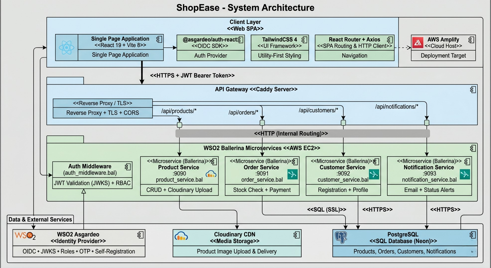
  <br/><em>System Architecture Diagram — Created with Visual Paradigm</em>
</p>

---

## 🛠 Tech Stack

| Layer | Technology | Purpose |
|---|---|---|
| **Language** | WSO2 Ballerina `2201.13.4` | Backend microservices runtime |
| **Identity** | WSO2 Asgardeo | Authentication, authorization, user management |
| **Frontend** | React 19 + Vite 8 | Single-page application |
| **Styling** | TailwindCSS 4 | Utility-first CSS framework |
| **Icons** | Lucide React | Modern icon library |
| **HTTP Client** | Axios | API communication |
| **Routing** | React Router DOM 7 | Client-side routing |
| **Database** | PostgreSQL (Neon) | Cloud-hosted relational database |
| **Image CDN** | Cloudinary | Product image upload & delivery |
| **Frontend Hosting** | AWS Amplify | CI/CD & static site hosting |
| **Backend Hosting** | AWS EC2 | Ballerina services runtime |
| **Reverse Proxy** | Caddy | HTTPS, CORS, path-based routing |

---

## ✨ Features

### 🛍️ Customer-Facing Features
- **Product Browsing** — Browse products with category filtering (Electronics, Clothing, Books, Home & Garden, Toys, Sports, etc.)
- **Product Search** — Search products by name or brand
- **Product Details** — View detailed product information with actual vs. selling price comparison
- **Shopping Cart** — Add, remove, and manage items in cart with quantity controls
- **Secure Checkout** — Place orders with shipping address and automatic payment processing
- **Order Tracking** — Track order status in real-time (Processing → Shipped → Delivered)
- **User Profile** — View account details and order history via profile dropdown

### 🔐 Authentication & Security
- **Asgardeo-Powered Sign Up** — Self-service registration with OTP email verification
- **Asgardeo-Powered Login** — OAuth 2.0 / OpenID Connect authentication flow
- **JWT-Based API Security** — All protected endpoints validate Asgardeo-issued JWT tokens
- **Role-Based Access Control** — Admin vs. Customer role enforcement on both frontend routes and backend APIs

### 📊 Admin Dashboard
- **Dashboard Overview** — Real-time stats (products, orders, customers, revenue, pending orders, low stock alerts)
- **Inventory Management** — Full CRUD operations with image upload to Cloudinary, dual pricing management, stock control
- **Order Management** — View all orders, update order statuses (Processing → Shipped → Delivered → Cancelled)
- **Notification Tracking** — View order-related notification history

---

## 📸 Screenshots

### Homepage & Navigation
The storefront features a professional navigation bar with category search, shopping cart, and user account management.

<p align="center">
  
  <br/><em>Landing page with hero banner, category navigation, and Sign Up / Login options</em>
</p>

### User Registration (WSO2 Asgardeo)
Users register through the Asgardeo-hosted registration form with email OTP verification.

<p align="center">
  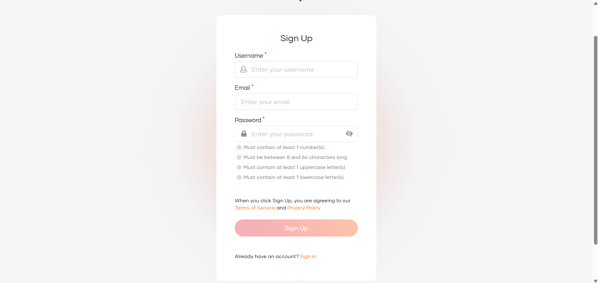
  <br/><em>Asgardeo self-service registration form — secure, branded identity management</em>
</p>

<p align="center">
  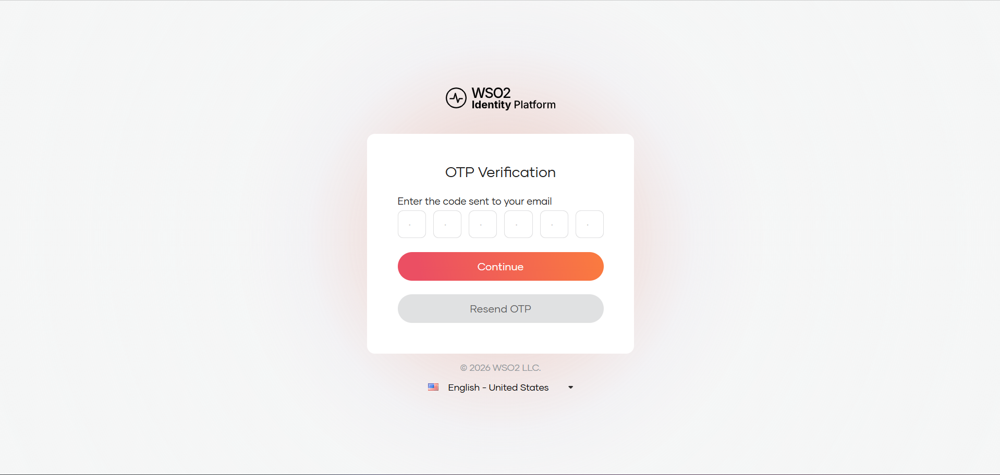
  <br/><em>Email OTP verification powered by Asgardeo for account security</em>
</p>

### Authenticated User Experience
After successful login, users can browse products, manage their cart, and track orders.

<p align="center">
  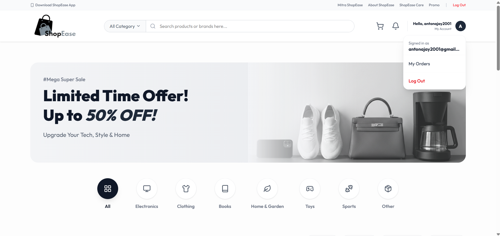
  <br/><em>Authenticated homepage with user profile dropdown, showing "My Orders" and "Log Out"</em>
</p>

### Shopping Experience

<p align="center">
  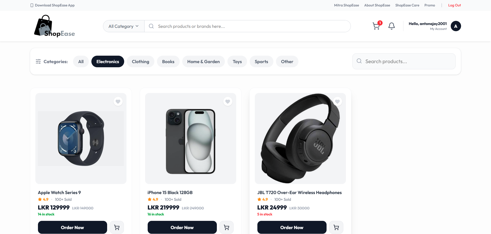
  <br/><em>Product detail page with "Add to Cart" — shows actual vs. selling price</em>
</p>

<p align="center">
  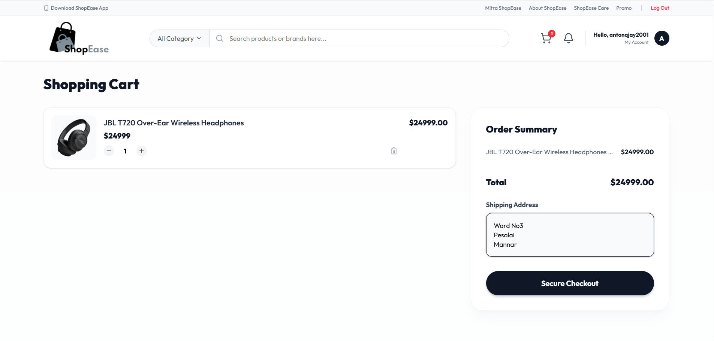
  <br/><em>Checkout page with order summary, shipping address, and payment confirmation</em>
</p>

<p align="center">
  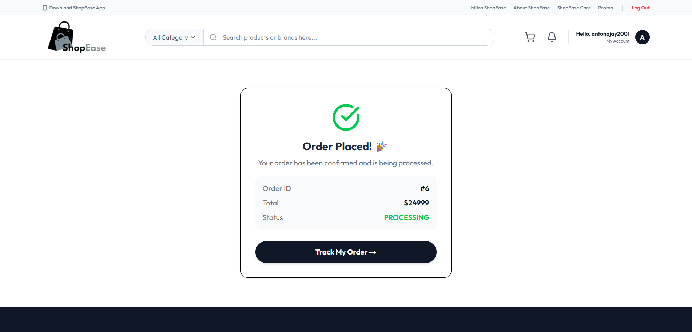
  <br/><em>Order confirmation — order placed successfully via Ballerina Order Service</em>
</p>

### Order Tracking

<p align="center">
  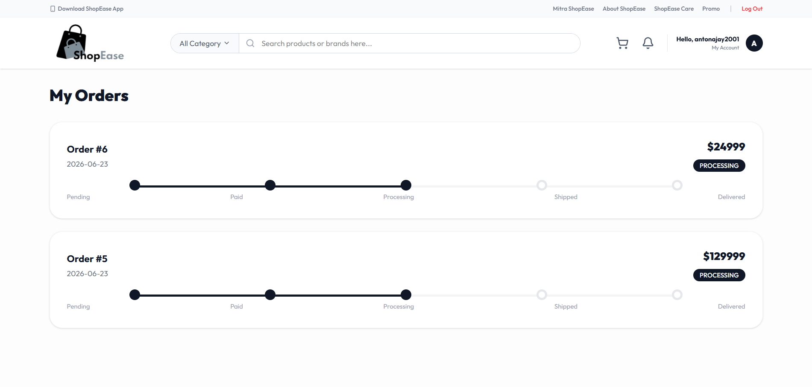
  <br/><em>Real-time order tracking page — status updates from Ballerina backend</em>
</p>

### Admin Panel (Role-Based Access via Asgardeo)
Admin access is protected by Asgardeo RBAC — only users with the "admin" role can access the dashboard.

<p align="center">
  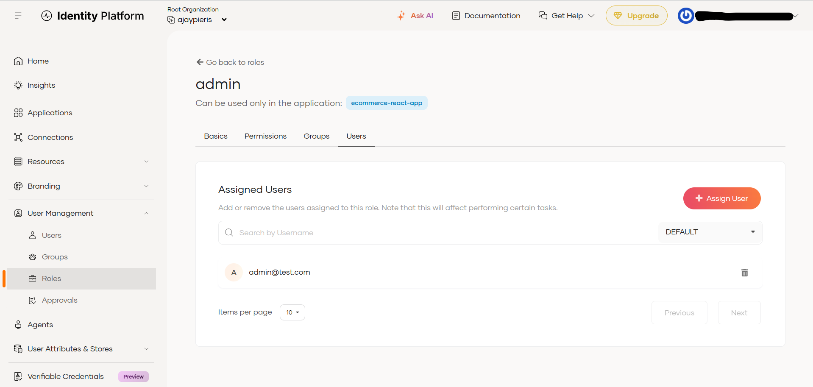
  <br/><em>Admin authentication flow — Asgardeo validates admin role from JWT claims</em>
</p>

<p align="center">
  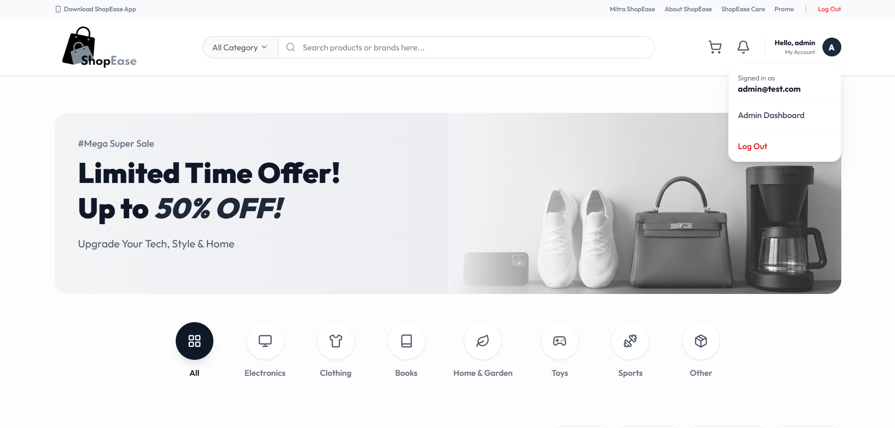
  <br/><em>Admin profile dropdown showing "Admin Dashboard" link — role detected from Asgardeo token</em>
</p>

<p align="center">
  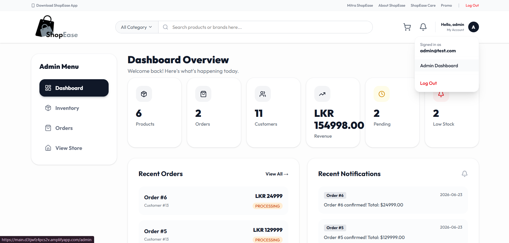
  <br/><em>Admin Dashboard — real-time overview with products, orders, customers, revenue, pending & low-stock metrics</em>
</p>

<p align="center">
  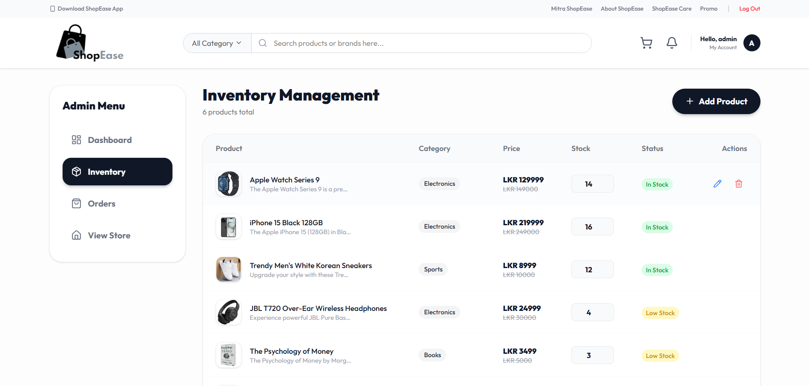
  <br/><em>Inventory Management — CRUD operations with image upload, dual pricing, and stock control</em>
</p>

### Order Status Management

<p align="center">
  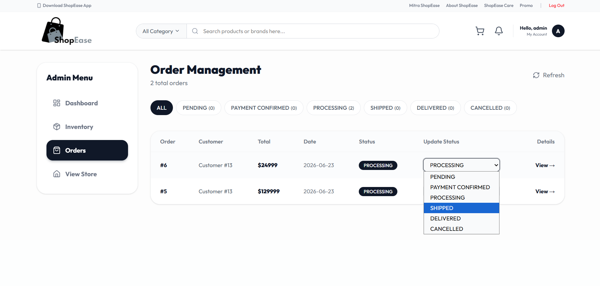
  <br/><em>Admin Order Management — update order status (Processing → Shipped → Delivered)</em>
</p>

<p align="center">
  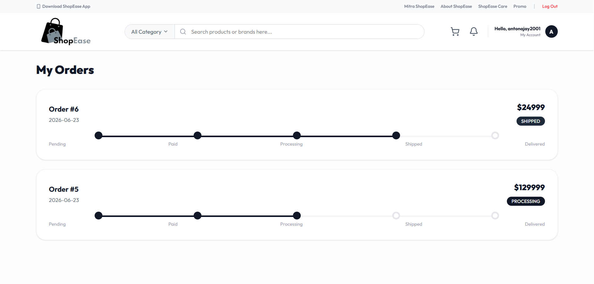
  <br/><em>Customer-side order tracking reflects real-time status changes made by admin</em>
</p>

---

## 📁 Project Structure

```
ecommerce-order-system/
│
├── backend/                          # WSO2 Ballerina Backend
│   ├── Ballerina.toml                # Project config (org, name, dependencies)
│   ├── Config.toml                   # Runtime config (DB, Asgardeo, Cloudinary)
│   ├── main.bal                      # Application entry point
│   ├── product_service.bal           # Product CRUD + Cloudinary upload (port 9090)
│   ├── order_service.bal             # Order lifecycle management (port 9091)
│   ├── customer_service.bal          # Customer registration & lookup (port 9092)
│   ├── notification_service.bal      # Notification logging & email (port 9093)
│   └── auth_middleware.bal           # JWT validation + RBAC via Asgardeo JWKS
│
├── frontend/                         # React 19 Frontend
│   ├── src/
│   │   ├── App.jsx                   # Routes + ProtectedRoute (role-based)
│   │   ├── main.jsx                  # Asgardeo AuthProvider setup
│   │   ├── components/
│   │   │   ├── Navbar.jsx            # Navigation with auth state
│   │   │   ├── Footer.jsx            # Site footer
│   │   │   ├── ProductCard.jsx       # Product display card
│   │   │   └── AdminLayout.jsx       # Admin sidebar layout
│   │   ├── pages/
│   │   │   ├── Home.jsx              # Landing page with hero & categories
│   │   │   ├── Products.jsx          # Product listing with filters
│   │   │   ├── ProductDetails.jsx    # Single product view
│   │   │   ├── Cart.jsx              # Shopping cart
│   │   │   ├── OrderStatus.jsx       # Customer order tracking
│   │   │   ├── Callback.jsx          # Asgardeo OAuth callback handler
│   │   │   └── admin/
│   │   │       ├── Dashboard.jsx     # Admin overview metrics
│   │   │       ├── Inventory.jsx     # Product CRUD management
│   │   │       └── Orders.jsx        # Order status management
│   │   ├── context/
│   │   │   ├── AuthContext.jsx       # Asgardeo auth state + role detection
│   │   │   └── CartContext.jsx       # Shopping cart state management
│   │   └── services/
│   │       └── api.js                # Axios API client configuration
│   ├── .env                          # Environment variables (Asgardeo config)
│   └── package.json                  # Dependencies & scripts
│
├── Caddyfile                         # Reverse proxy config (API routing)
├── docs/images/                      # Documentation screenshots
└── Readme.md                         # This file
```

---

## 🚀 Getting Started

### Prerequisites

| Tool | Version | Download |
|---|---|---|
| WSO2 Ballerina | `2201.13.4` (Swan Lake) | [ballerina.io/downloads](https://ballerina.io/downloads/) |
| Node.js | `18+` | [nodejs.org](https://nodejs.org/) |
| PostgreSQL | `15+` | Any provider (Neon, Supabase, local) |
| WSO2 Asgardeo Account | Free tier | [asgardeo.io](https://asgardeo.io/) |

### 1. Clone the Repository

```bash
git clone https://github.com/your-username/ecommerce-order-system.git
cd ecommerce-order-system
```

### 2. Configure the Database

Create the following tables in your PostgreSQL database:

```sql
CREATE TABLE products (
    id SERIAL PRIMARY KEY,
    name VARCHAR(255) NOT NULL,
    description TEXT,
    price DECIMAL(10,2) NOT NULL,
    actual_price DECIMAL(10,2),
    stock_quantity INTEGER NOT NULL DEFAULT 0,
    image_url TEXT,
    category VARCHAR(100)
);

CREATE TABLE customers (
    id SERIAL PRIMARY KEY,
    asgardeo_user_id VARCHAR(255) UNIQUE NOT NULL,
    email VARCHAR(255) NOT NULL,
    full_name VARCHAR(255),
    phone VARCHAR(50),
    address TEXT
);

CREATE TABLE orders (
    id SERIAL PRIMARY KEY,
    customer_id INTEGER REFERENCES customers(id),
    total_amount DECIMAL(10,2) NOT NULL,
    status VARCHAR(50) DEFAULT 'PENDING',
    payment_status VARCHAR(50) DEFAULT 'UNPAID',
    shipping_address TEXT,
    created_at TIMESTAMP DEFAULT CURRENT_TIMESTAMP,
    updated_at TIMESTAMP DEFAULT CURRENT_TIMESTAMP
);

CREATE TABLE order_items (
    id SERIAL PRIMARY KEY,
    order_id INTEGER REFERENCES orders(id),
    product_id INTEGER REFERENCES products(id),
    quantity INTEGER NOT NULL,
    unit_price DECIMAL(10,2) NOT NULL,
    subtotal DECIMAL(10,2) NOT NULL
);

CREATE TABLE notifications (
    id SERIAL PRIMARY KEY,
    order_id INTEGER REFERENCES orders(id),
    type VARCHAR(50),
    message TEXT,
    sent_at TIMESTAMP DEFAULT CURRENT_TIMESTAMP
);
```

### 3. Configure Asgardeo

1. Create an application in [Asgardeo Console](https://console.asgardeo.io/)
2. Set application type to **Single Page Application (SPA)**
3. Configure redirect URLs:
   - Sign-in redirect: `http://localhost:5173/callback`
   - Sign-out redirect: `http://localhost:5173`
4. Enable **Self-Registration** in the Asgardeo console
5. Create an **Admin** role/group and assign it to your admin user
6. Enable the following scopes: `openid`, `profile`, `email`, `groups`

### 4. Configure Backend

Edit `backend/Config.toml` with your credentials:

```toml
[ecommerce.ballerina_backend]
dbHost = "your-db-host"
dbPort = 5432
dbName = "your-db-name"
dbUser = "your-db-user"
dbPassword = "your-db-password"
asgardeoIssuer = "https://api.asgardeo.io/t/your-org/oauth2/token"
asgardeoJwksUrl = "https://api.asgardeo.io/t/your-org/oauth2/jwks"

CLOUDINARY_CLOUD_NAME = "your-cloud-name"
CLOUDINARY_API_KEY = "your-api-key"
CLOUDINARY_API_SECRET = "your-api-secret"
```

### 5. Configure Frontend

Edit `frontend/.env`:

```env
VITE_ASGARDEO_CLIENT_ID=your-asgardeo-client-id
VITE_ASGARDEO_BASE_URL=https://api.asgardeo.io/t/your-org
VITE_ASGARDEO_SIGN_IN_REDIRECT=http://localhost:5173/callback
VITE_ASGARDEO_SIGN_OUT_REDIRECT=http://localhost:5173
VITE_API_BASE_URL=http://localhost:9090
```

### 6. Run the Backend

```bash
cd backend
bal run
```

This starts all four microservices:
- Product Service → `http://localhost:9090/api/products`
- Order Service → `http://localhost:9091/api/orders`
- Customer Service → `http://localhost:9092/api/customers`
- Notification Service → `http://localhost:9093/api/notifications`

### 7. Run the Frontend

```bash
cd frontend
npm install
npm run dev
```

The frontend starts at `http://localhost:5173`

---

## 📡 API Reference

### Product Service (`:9090`)

| Method | Endpoint | Auth | Description |
|---|---|---|---|
| `GET` | `/api/products` | Public | Get all products |
| `GET` | `/api/products/{id}` | Public | Get product by ID |
| `GET` | `/api/products/category/{name}` | Public | Filter by category |
| `POST` | `/api/products` | Admin | Create product (with image upload) |
| `PUT` | `/api/products/{id}` | Public | Update product |
| `PUT` | `/api/products/{id}/stock` | Public | Update stock quantity |
| `DELETE` | `/api/products/{id}` | Public | Delete product |

### Order Service (`:9091`)

| Method | Endpoint | Auth | Description |
|---|---|---|---|
| `GET` | `/api/orders` | Public | Get all orders |
| `GET` | `/api/orders/{id}` | Public | Get order with items |
| `GET` | `/api/orders/customer/{id}` | Public | Get customer's orders |
| `POST` | `/api/orders` | Public | Place new order (stock validation + payment) |
| `PUT` | `/api/orders/{id}/status` | Public | Update order status |

### Customer Service (`:9092`)

| Method | Endpoint | Auth | Description |
|---|---|---|---|
| `GET` | `/api/customers` | Public | Get all customers |
| `GET` | `/api/customers/{id}` | Public | Get customer by ID |
| `GET` | `/api/customers/byuser/{asgardeoId}` | Public | Lookup by Asgardeo ID |
| `POST` | `/api/customers` | Public | Register customer |
| `PUT` | `/api/customers/{id}` | Public | Update customer profile |

### Notification Service (`:9093`)

| Method | Endpoint | Auth | Description |
|---|---|---|---|
| `GET` | `/api/notifications` | Public | Get all notifications |
| `GET` | `/api/notifications/order/{id}` | Public | Get notifications for order |
| `POST` | `/api/notifications` | Public | Create notification |
| `POST` | `/api/notifications/order-status` | Public | Send order status email |

---

## 🚢 Deployment

### Frontend — AWS Amplify

The React frontend is deployed on **AWS Amplify** with automatic CI/CD:

- **URL:** [https://main.d3tjwfz4pcs2v.amplifyapp.com/](https://main.d3tjwfz4pcs2v.amplifyapp.com/)
- **Build command:** `npm run build`
- **Output directory:** `dist`
- **Framework:** Vite

### Backend — AWS EC2

The Ballerina backend services run on an **AWS EC2** instance:

- **Instance:** Amazon Linux / Ubuntu on AWS EC2
- **Reverse Proxy:** Caddy (handles HTTPS, CORS, and path-based API routing)
- **Process Manager:** Background services via `bal run`

### Database — Neon PostgreSQL

- **Provider:** [Neon](https://neon.tech/) (serverless PostgreSQL)
- **Region:** `us-east-1`
- **Connection:** SSL-encrypted pooled connections

---

## 🔑 How WSO2 Products Power This Application

### End-to-End Order Flow (WSO2 Ballerina)

```
1. Customer browses products        → Ballerina Product Service (GET /api/products)
2. Customer adds items to cart      → React CartContext (client-side)
3. Customer places order            → Ballerina Order Service (POST /api/orders)
   ├── Stock validation             → Ballerina queries PostgreSQL
   ├── Payment processing           → Ballerina mock payment function
   ├── Stock deduction              → Ballerina UPDATE query
   ├── Order record creation        → Ballerina INSERT query
   └── Notification logging         → Ballerina INSERT into notifications
4. Admin updates order status       → Ballerina Order Service (PUT /api/orders/{id}/status)
5. Customer tracks order            → Ballerina Order Service (GET /api/orders/customer/{id})
```

### Authentication & Authorization Flow (WSO2 Asgardeo)

```
1. User clicks "Sign Up"           → Redirected to Asgardeo registration page
2. User fills registration form    → Asgardeo handles validation + OTP email
3. User verifies OTP               → Asgardeo confirms account creation
4. User clicks "Login"             → Redirected to Asgardeo login page
5. Asgardeo authenticates          → Issues OAuth2 tokens (ID Token + Access Token)
6. React app receives JWT          → Extracts roles from token claims
7. Admin routes protected          → Frontend checks role === "admin"
8. API calls include Bearer token  → Ballerina validates JWT via Asgardeo JWKS
9. Admin API endpoints             → Ballerina checks admin role in JWT claims
```

---

## 👤 Author

**Ajay Pieris**

---

## 📄 License

This project is developed for educational purposes as part of a WSO2 product evaluation. All rights reserved.

---

<p align="center">
  <strong>Built with ❤️ using WSO2 Ballerina & WSO2 Asgardeo</strong>
</p>